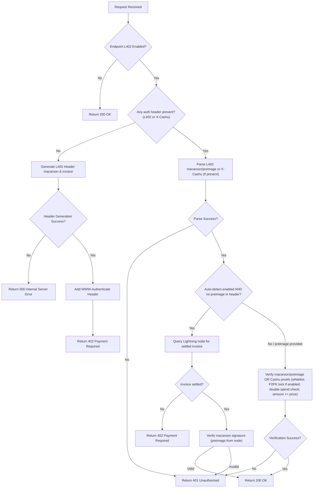

# ngx_l402 — L402 Nginx Module

An [L402](https://docs.lightning.engineering/the-lightning-network/l402) authentication module for Nginx that enables Lightning Network-based monetization for your REST APIs (HTTP/1 and HTTP/2).

It supports the following Lightning backends:

| Backend | Description |
|---|---|
| **LND** | Lightning Network Daemon (direct gRPC) |
| **LNC** | Lightning Node Connect (remote LND via mailbox) |
| **CLN** | Core Lightning |
| **Eclair** | Eclair node |
| **LNURL** | Lightning Network URL |
| **NWC** | Nostr Wallet Connect — receive into any NWC wallet |
| **BOLT12** | Reusable Lightning Offers |

The module can be configured to charge per unique API call, enabling per-endpoint monetization based on request paths.


---

## How It Works



> **Auto-detect**: When `l402_auto_detect_payment on` is set and the client sends only `Authorization: L402 <macaroon>` (no preimage), the server queries the Lightning node directly. Supported on **LND**, **CLN**, **BOLT12**, **Eclair**, and **NWC** wallets that implement `lookup_invoice` — see [the support matrix](./lightning.md#backend-support-matrix).

### Response Codes

| Status | When |
|---|---|
| `200` | Payment verified — the upstream response is returned |
| `402` | No credential presented, or auto-detect found the invoice unpaid. Carries the `WWW-Authenticate` L402 challenge, and `X-Cashu` when Cashu is enabled |
| `401` | A credential was presented and failed: malformed, tampered, replayed, or the preimage does not match. Carries `WWW-Authenticate: L402`; retry without a credential for a fresh challenge |
| `400` | A Cashu token from an unlisted mint, in the wrong unit, or below the price once the mint's input fee is taken out |
| `429` | Invoice rate limit hit (`l402_invoice_rate_limit`) |
| `500` | The gateway failed — an unreachable mint, Lightning node or Redis, or a failed database write, not a problem with your payment |
| `503` | A Lightning credential arrived while `REDIS_URL` is set but Redis is unreachable; retry once it is back |

`402` only asks for payment: the initial challenge, or an auto-detect invoice
not paid yet. A credential that fails is `401`, never `402` — [the L402
specification](https://github.com/lightninglabs/L402/blob/master/protocol-specification.md)
requires this so clients can tell "you need to pay" from "your credential is
broken". The `400` cases are the ones
[NUT-24](https://github.com/cashubtc/nuts/blob/main/24.md) names.

A `500` on a request that carried a Cashu token leaves the token's fate unknown:
swapping it at the mint and recording the proofs are separate steps, so a failure
between them may have spent the token or not touched it. Treat it as an outage
rather than a rejected payment, and don't discard the token. Other `500`s — a
missing price, an uninitialised module — are unrelated to payment.

---

## Quick Start

> **Note**: This module requires **NGINX version 1.28.0** or later.

The fastest way to get started is with Docker:

```bash
docker run -d \
  --name l402-nginx \
  -p 8000:8000 \
  -e LN_CLIENT_TYPE=LNURL \
  -e LNURL_ADDRESS=username@your-lnurl-server.com \
  -e ROOT_KEY=your-32-byte-hex-key \
  ghcr.io/ngx-l402/ngx-l402:latest
```

Then test it:

```bash
# Should return 200 OK
curl http://localhost:8000/

# Should return 402 Payment Required with L402 header
curl -i http://localhost:8000/protected
```

See the [Installation](./install-manual.md) section for full setup options.

